## Architecture Overview
The chat handler follows a multi-stage pipeline:

1. Message Preprocessing - Parse arguments, extract files/images
2. Conversation Management - Load/cleanup conversation history
3. Embedding Retrieval - Fetch relevant knowledge (ChromaDB or RAG)
4. Message Preparation - Build API payload with context
5. API Call & Function Execution - Get response, handle function calls
6. Response Processing - Clean, format, and send reply

### Sequence Diagram

```mermaid
sequenceDiagram
    participant User
    participant Discord
    participant ChatHandler
    participant Conversation
    participant EmbeddingAPI
    participant ChromaDB
    participant RAGUtils
    participant OpenAI/Ollama
    participant FunctionMap

    User->>Discord: Send message with [p]chat
    Discord->>ChatHandler: handle_message()
    
    Note over ChatHandler: Parse arguments<br/>(--outputfile, --extract, --last)
    Note over ChatHandler: Extract attachments<br/>(images, code files)
    
    ChatHandler->>Conversation: get_conversation(user_id, channel_id)
    Conversation-->>ChatHandler: Return conversation object
    
    ChatHandler->>Conversation: cleanup() & refresh()
    Note over Conversation: Remove expired messages<br/>Trim to max retention
    
    alt Message qualifies for embedding
        Note over ChatHandler: Check conditions:<br/>- Has embeddings<br/>- Message > 1 word<br/>- top_n > 0<br/>- tokens < 8191
        
        ChatHandler->>EmbeddingAPI: request_embedding(message)
        EmbeddingAPI-->>ChatHandler: query_embedding [float array]
        
        alt RAGUtils Available
            ChatHandler->>RAGUtils: get_rag_config(guild_id)
            RAGUtils-->>ChatHandler: rag_config (rerank, MMR, chunking settings)
            
            Note over ChatHandler: use_rag = True
            
            ChatHandler->>RAGUtils: enhanced_retrieval()
            
            Note over RAGUtils: RAG Pipeline Steps:
            
            alt Chunking Enabled
                RAGUtils->>RAGUtils: chunk_text()<br/>(sentence-aware, 12-120 words)
            end
            
            alt Using Qdrant Backend
                RAGUtils->>RAGUtils: QdrantBackend.query()
                Note over RAGUtils: Query Qdrant server<br/>for similar embeddings
            else Using ChromaDB Backend
                RAGUtils->>ChromaDB: collection.query()
                ChromaDB-->>RAGUtils: Initial results
            end
            
            Note over RAGUtils: Apply keyword/numeric boosting<br/>(dates, numbers, procedures)
            
            alt Reranking Enabled
                RAGUtils->>RAGUtils: rerank_with_cross_encoder()
                Note over RAGUtils: Use cross-encoder model<br/>Filter by threshold (0.33)
            end
            
            alt MMR Enabled
                RAGUtils->>RAGUtils: mmr_rerank()
                Note over RAGUtils: Diversify results<br/>lambda=0.5 (relevance vs diversity)
            end
            
            RAGUtils-->>ChatHandler: Enhanced results [(name, text, score, dim)]
            
        else Standard ChromaDB Only
            ChatHandler->>Conversation: conf.get_related_embeddings()
            Conversation->>ChromaDB: collection.query(query_embedding, top_n)
            ChromaDB-->>Conversation: results (cosine similarity)
            Conversation-->>ChatHandler: related [(name, text, score, dim)]
        end
    end
    
    Note over ChatHandler: Build messages array
    
    ChatHandler->>ChatHandler: prepare_messages()
    
    Note over ChatHandler: Format system prompt<br/>with placeholders
    
    alt Embeddings Retrieved
        Note over ChatHandler: Inject embeddings based on method:
        alt embed_method = "static"
            Note over ChatHandler: Add to user message
        else embed_method = "dynamic"
            Note over ChatHandler: Add to system prompt
        else embed_method = "hybrid"
            Note over ChatHandler: First → user message<br/>Rest → system prompt
        else embed_method = "user"
            Note over ChatHandler: Add to initial prompt
        end
    end
    
    Note over ChatHandler: Add conversation history<br/>Add images (if vision model)<br/>Add function schemas
    
    ChatHandler->>ChatHandler: degrade_conversation()
    Note over ChatHandler: Trim messages to fit<br/>within token limit
    
    ChatHandler->>OpenAI/Ollama: request_response(messages, functions)
    OpenAI/Ollama-->>ChatHandler: response (content or function_call)
    
    alt Response has function calls
        loop For each function call
            ChatHandler->>FunctionMap: Execute function(args)
            
            alt Function = create_memory/edit_memory
                FunctionMap->>EmbeddingAPI: Generate embedding
                EmbeddingAPI-->>FunctionMap: embedding vector
                FunctionMap->>ChromaDB: Store embedding
                FunctionMap->>Discord: React with 🧠
            else Function = search_memories
                FunctionMap->>ChromaDB: Query embeddings
                ChromaDB-->>FunctionMap: Related memories
            else Other functions
                FunctionMap->>FunctionMap: Execute custom logic
            end
            
            FunctionMap-->>ChatHandler: function_result
            
            ChatHandler->>Conversation: Append function result
            ChatHandler->>OpenAI/Ollama: Continue with function result
            OpenAI/Ollama-->>ChatHandler: Final response
        end
    end
    
    ChatHandler->>Conversation: update_messages(reply, "assistant")
    
    Note over ChatHandler: Apply regex blacklist<br/>Extract code blocks (if --extract)
    
    ChatHandler->>Discord: send_reply(message, content)
    Discord->>User: Display response
```

