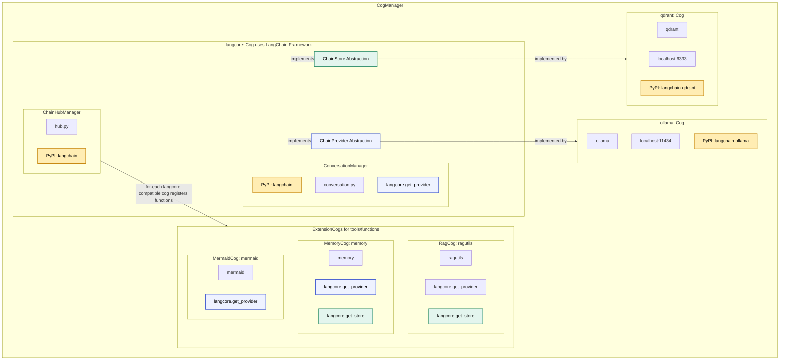
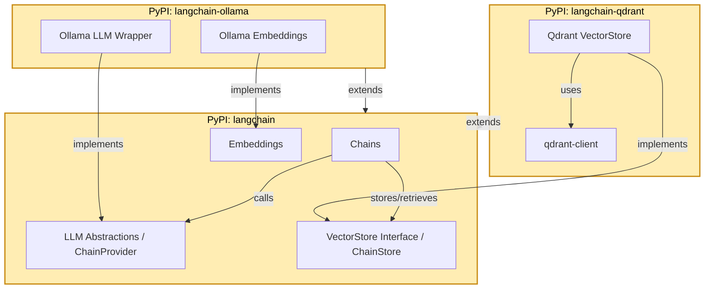

# AI automation cogs

Inspiration has been drawn from assistant (see `Synced Cogs Notice`), however since I am navigating "unused" code (OpenAI is ignored) too much I'll re-invent the wheel. Most of my changes are towards Ollama. Thus working with the original assistant cog has been quite a challenge.  
Huge thanks goes out towards [vertyco](http://github.com/vertyco/). While working with assistant I have learned quite a few things which makes me comfortable starting my own version.

## Architecture

## Red-DiscordBot Cogs Overview

### 1. langcore (Cog)
`langcore` is the **core framework cog** for the bot, built on top of the LangChain framework. It provides the foundational abstractions for AI agent orchestration:  

- **ChainProvider Abstraction**: Defines a standard interface for LLM providers.  
- **ChainStore Abstraction**: Defines a standard interface for vector storage and retrieval.  
- **ChainHub**: A registry for functions and tools that AI agents can access.  

All other cogs connect to `langcore` either by implementing its abstractions or registering functionality via ChainHub.

---

### 2. ollama (Cog)

`ollama` is the **ChainProvider implementation cog**.  

- Acts as the LLM backend for AI agents.  
- Implements the `ChainProvider` abstraction from `langcore`, enabling agents to query large language models.  
- Connects to an LLM service, e.g., `localhost:11434`.  

This cog allows agents to generate natural language responses and perform model-based reasoning.

---

### 3. qdrant (Cog)
`qdrant` is the **vector storage cog** and implements the `ChainStore` abstraction from `langcore`.  

- Provides persistent vector storage for embeddings.  
- Connects to a Qdrant service, e.g., `localhost:6333`.  

This cog serves as the AI agents’ long-term memory backend.

---

### 4. ragutils (Cog)
`rag` is a **retrieval-augmented generation (RAG) cog**:  

- Registers functions via `ChainHub` like `memory`.  
- Uses `ChainProvider` and `ChainStore` instances to enable agents to perform **retrieval-augmented reasoning**.  
- Combines vector-based memory search with LLM responses, enhancing answer accuracy and relevance by grounding generation in stored knowledge.

---

## Synced Cogs Notice

This repository mirrors two cogs that were authored elsewhere. **Please install them directly from their source repositories instead of from this mirror**.

- `assistant` — sourced from [`vertyco/vrt-cogs`](https://github.com/vertyco/vrt-cogs) (branch `main`). 
- `hotreload` — sourced from [`cswimr/SeaCogs`](https://c.csw.im/cswimr/SeaCogs) (branch `main`). 

These copies are synced for convenience and are not my creations. Please support and credit the original authors when using their cogs.

Huge thanks to [cswimr](https://c.csw.im/cswimr) and [vertyco](https://github.com/vertyco) for allowing me to mirror their work!