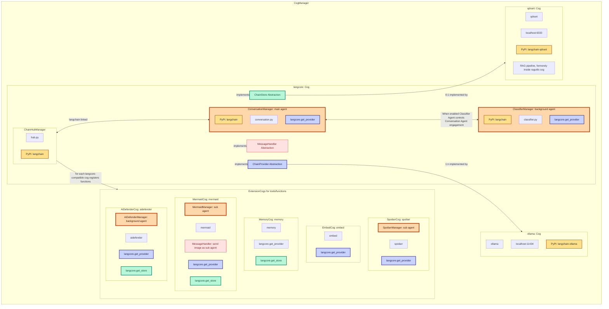
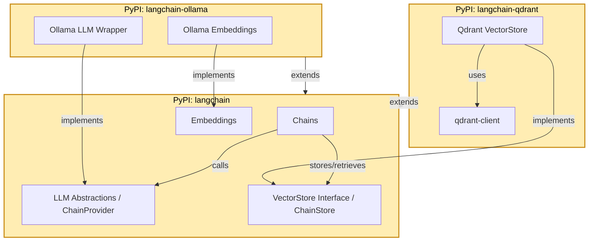
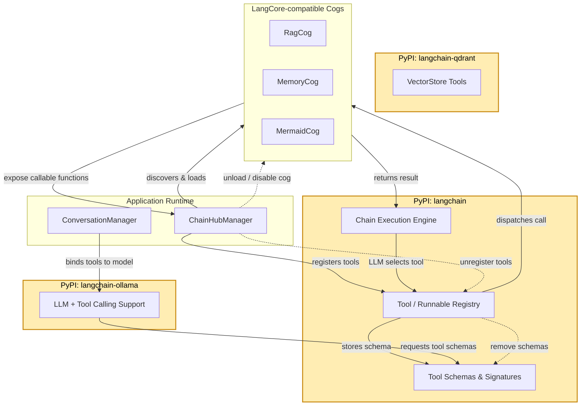

# AI automation cogs

Inspiration has been drawn from assistant (see `Synced Cogs Notice`), however since I am navigating "unused" code (OpenAI is ignored) too much I'll re-invent the wheel. Most of my changes are towards Ollama. Thus working with the original assistant cog has been quite a challenge.  
Huge thanks goes out towards [vertyco](http://github.com/vertyco/). While working with assistant I have learned quite a few things which makes me comfortable starting my own version.

## Architecture

### LangCore Cog Architecture and ChainHub Integration

Note: ConversationManager is growing in complexity. In future worth abstracting it so the ConversationManager can be overwritten by other cogs. Same goes for ClassifierManager.

*Managers are agents and don't share the same context.  

Discord Users are talking with the main agent -> Conversation Manager. Conversations are are not shared between Discord Users and are unique to the Discord User.  
A background agent, the ClassifierManager, decides if the Conversation Manager should engage in the conversation. This agent is disabled by default.  
You can also define your own background agents in order to e.g. spot abusive behavior through AI -> AI Defender Manager.  
Cogs may also define sub agents. They only become active through other agents. For example a Mermaid image should be created but there is a syntax error. The agent will fix the syntax error.

### LangChain PyPI Package Interaction and Extension Model

### Tool and Function Registration Lifecycle in LangCore

## Red-DiscordBot Cogs Overview

### 1. langcore (Cog)
`langcore` is the **core framework cog** for the bot, built on top of the LangChain framework. It provides the foundational abstractions for AI agent orchestration:  

- **ChainProvider Abstraction**: Defines a standard interface for LLM providers.  
- **ChainStore Abstraction**: Defines a standard interface for vector storage and retrieval.  
- **ChainHub**: A registry for functions and tools that AI agents can access.  

All other cogs connect to `langcore` either by implementing its abstractions or registering functionality via ChainHub.

In future `langcore.get_provider()` may be interesting when some LLM providers are unreliable -> return fallback providers.  
Or when you want to do load balancing accross your LLM providers.  

For BYOK users the ChainProvider implementation is easy, a simple endpoint with API key.  
For self-host hardware users you may want to define multiple endpoints.  
Or even combine both setup.

---

### 2. ollama (Cog)

`ollama` is the **ChainProvider implementation cog**.  

- Acts as the LLM backend for AI agents.  
- Implements the `ChainProvider` abstraction from `langcore`, enabling agents to query large language models.  
- Connects to an LLM service, e.g., `localhost:11434`.

This cog allows agents to generate natural language responses and perform model-based reasoning.

---

### 3. qdrant (Cog)
`qdrant` is the **vector storage cog** and implements the `ChainStore` abstraction from `langcore`.  

- Provides persistent vector storage for embeddings.  
- Connects to a Qdrant service, e.g., `localhost:6333`.  

This cog serves as the AI agents’ long-term memory backend.

Add RAG pipeline. Fomerely implemented as a cog ragutils for assistant cog. This will move directly into qdrant to be a part of it.

---

## Synced Cogs Notice

This repository mirrors cogs that were authored elsewhere. **Please install them directly from their source repositories instead of from this mirror**.

- `hotreload` — sourced from [`cswimr/SeaCogs`](https://c.csw.im/cswimr/SeaCogs) (branch `main`). 

These copies are synced for convenience and are not my creations. Please support and credit the original authors when using their cogs.

- `assistant` — sourced from [`vertyco/vrt-cogs`](https://github.com/vertyco/vrt-cogs) (branch `main`). 

Used to be mirroed but is replaced by the cogs `langcore`, `ollama` and `qdrant`.

Huge thanks to [cswimr](https://c.csw.im/cswimr) and [vertyco](https://github.com/vertyco) for allowing me to mirror their work!