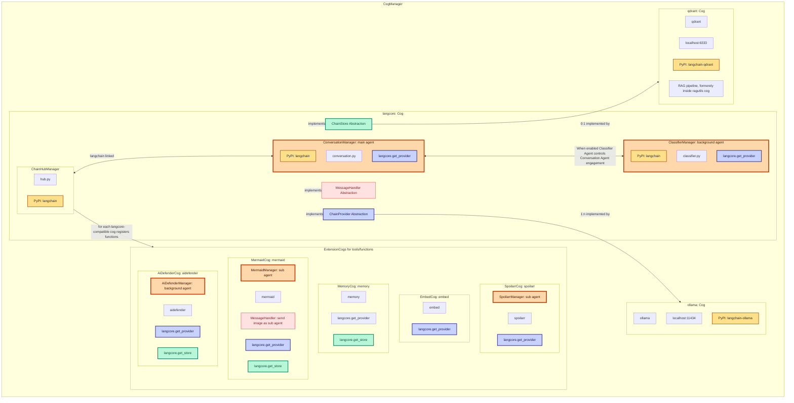

# LangCore Integration

LangCore orchestrates AI agents, tool registration, and provider/store abstraction. It exposes `ChainProvider`, `ChainStore`, and `MessageHandler` interfaces that other cogs implement or consume.

## ChainHub integration

ConversationManager is growing in complexity; future work will abstract it so alternative managers can be swapped in. The same applies to ClassifierManager. Managers are agents and do not share context. Discord users interact with the ConversationManager; the ClassifierManager can gate responses. Background agents like AI Defender and sub-agents like Mermaid Manager operate independently, only engaging when their capabilities are needed.

## Agent patterns
- **ConversationManager**: main agent coordinating tool calls and responses.
- **ClassifierManager**: optional background agent that decides if the conversation agent should engage.
- **Sub-agents**: specialized managers (e.g., MermaidManager) that run isolated tool loops but can add context back to conversations.

LangCore links these agents through ChainHub so extension cogs can register tools without tight coupling. For extension guidance, see [core/extension-guide.md](../core/extension-guide.md).
