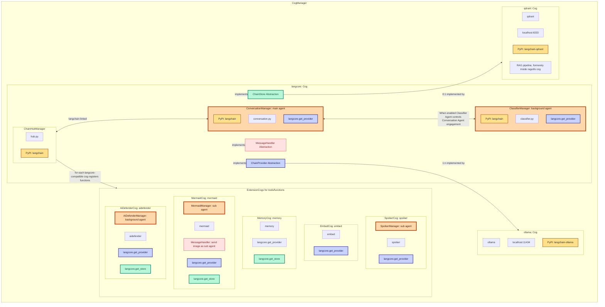
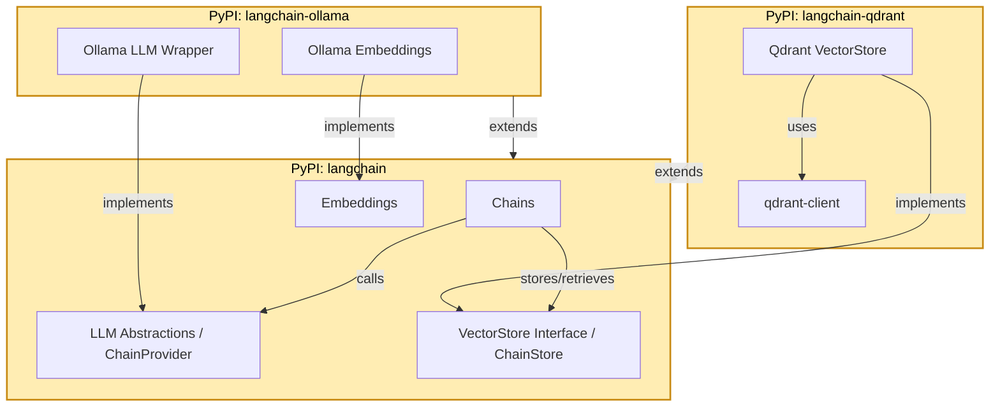
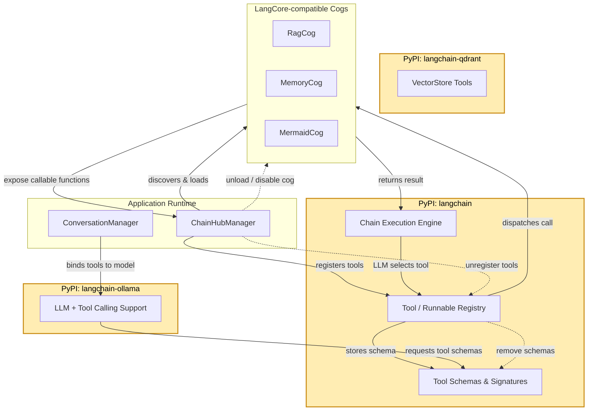

# Architecture Overview

The d-cogs collection layers shared interfaces, a core orchestration cog, and pluggable providers/stores/extensions. Cross-cog contracts live in `cogchain`, while LangCore manages conversations, tool registration, and coordination with provider/store cogs.

## Shared interfaces via `cogchain`

Cross-cog contracts live in the `cogchain` package so features can evolve without tight coupling. Langcore, providers, stores, and extension cogs all import the same interfaces instead of reaching into each other.

```mermaid
flowchart LR
    subgraph PyPI Package
        CC[cogchain\n(interfaces + models)]
    end

    subgraph Core Cog
        LC[langcore]
    end

    subgraph Providers
        OR[openrouter]
        OL[ollama]
    end

    subgraph Stores
        QD[qdrant]
    end

    subgraph Extensions
        SP[spoilarr]
        MM[mermaid]
        EM[embed]
    end

    CC --> LC
    CC --> OR
    CC --> OL
    CC --> QD
    CC --> SP
    CC --> MM
    CC --> EM
```

## LangCore Cog architecture and ChainHub integration

LangCore provides the agent orchestration, conversation management, and tool registration pipeline. Conversation and classifier managers are separate agents; extension cogs register tools through ChainHub.



ConversationManager is the main agent, while the ClassifierManager is a background agent that can gate engagement. Sub-agents (e.g., MermaidManager) handle specialized tool loops without sharing context.

## LangChain PyPI package interaction and extension model



## Tool and function registration lifecycle in LangCore



Each diagram reflects how cogs communicate through interfaces, how ChainHub manages tool registration, and how LangChain packages supply the underlying LLM and vector store abstractions.
