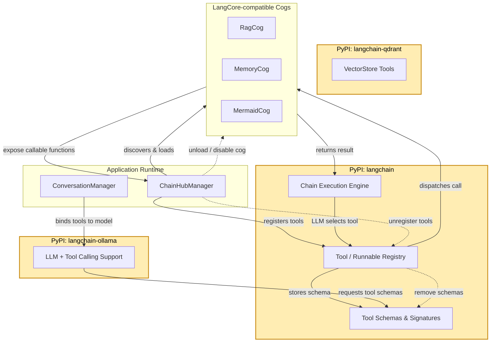

# Tool Registration

LangCore’s ChainHub discovers extension cogs, registers their tool schemas with LangChain, and binds them to the active provider. This lifecycle keeps tool exposure declarative and reversible.

Tool callbacks accept an injected `ExtensionContext`, allowing providers and stores to be resolved per guild and tools to add messages back to the conversation safely. Unloading a cog cleanly unregisters its tool schemas, avoiding stale bindings.
