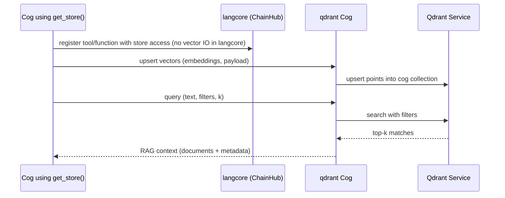
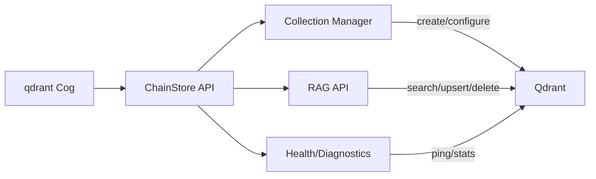

# qdrant Cog

`qdrant` is the vector storage cog and implements the `ChainStore` abstraction from `langcore`.

- Provides persistent vector storage for embeddings.
- Connects to a Qdrant service, e.g., `localhost:6333`.
- Adds the RAG pipeline that formerly lived in `ragutils`, making retrieval native to the store cog.

## Architecture

```mermaid
graph TD
	subgraph DiscordBot
		LangCore[langcore: ChainHub (no vector IO)]
		QdrantCog[qdrant: ChainStore]
		OtherCogs[Extension cogs using get_store]
	end

	subgraph QdrantCluster[Qdrant Server]
		CollA[Collection: spoilarr]
		CollB[Collection: memory]
		CollC[Collection: embed]
	end

	LangCore -.->|tool schemas / store handle| QdrantCog
	OtherCogs -->|write/read own collection| QdrantCog
	QdrantCog -->|CRUD + search| QdrantCluster
```

## RAG pipeline



### Component responsibilities



### Key principles (from the roadmap)
- Single, pluggable ChainStore for all cogs; each cog owns its collection (with optional per-guild suffixing later).
- RAG pipeline migrated from `ragutils`; `langcore` itself does not store or retrieve vectors.
- Configurable vector dimensions, metrics, and collection settings, with health checks and admin tooling planned.
