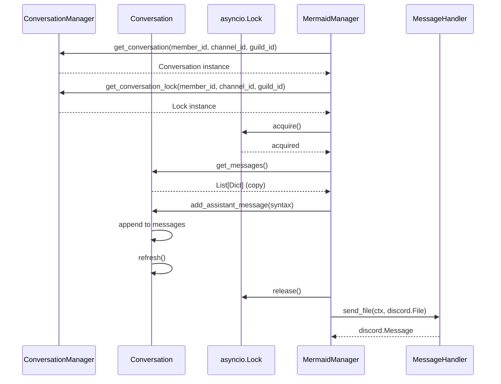
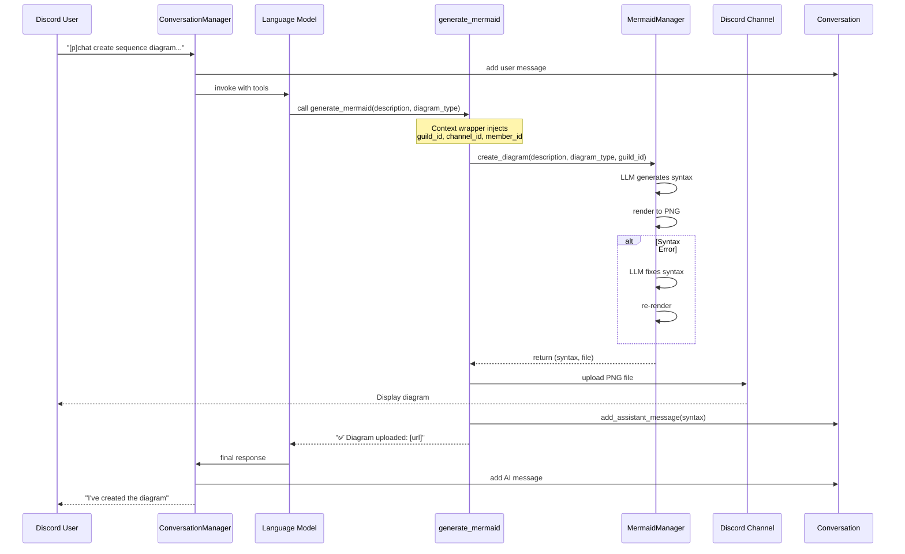

# langcore Cog

`langcore` is the core framework cog for the bot, built on top of the LangChain framework. It provides the foundational abstractions for AI agent orchestration:

- **ChainProvider Abstraction**: Defines a standard interface for LLM providers.
- **ChainStore Abstraction**: Defines a standard interface for vector storage and retrieval.
- **ChainHub**: A registry for functions and tools that AI agents can access.

All other cogs connect to `langcore` either by implementing its abstractions or registering functionality via ChainHub. In future `langcore.get_provider()` may be interesting when some LLM providers are unreliable -> return fallback providers or handle load balancing.

For BYOK users the ChainProvider implementation is easy, a simple endpoint with API key. Self-hosted hardware users may define multiple endpoints or combine both setups.

## Conversation class architecture

MessageHandler sends Discord-facing messages. Sub-agents like the Mermaid Manager can also send messages; the Conversation class keeps the main agent aware of the topic even when sub-agents act.

## Integration notes
- Tool wrappers inject an `ExtensionContext` (`guild_id`, `channel_id`, `member_id`, `langcore`) instead of loose kwargs. Use `ctx.get_provider()` and `await ctx.add_to_conversation(...)` to avoid manual locking.
- Guilds configure their preferred LLM with `[p]langcore defaultprovider <name>`; `ctx.get_provider()` honors that setting.
- Lazy loading: extension and provider cogs register on `on_langcore_cog_add` and avoid hard `langcore` imports so standalone features continue working when langcore is absent.
- Extension cogs can define sub-agents (e.g., MermaidManager) that run their own tool loop while writing results back to the conversation.
