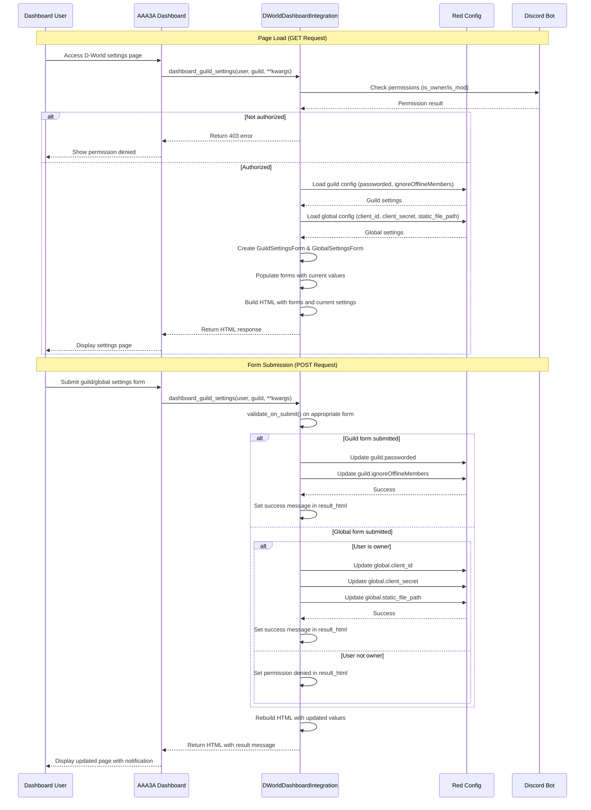

```mermaid
sequenceDiagram
    participant User as Dashboard User
    participant Dashboard as AAA3A Dashboard
    participant DWorldDash as DWorldDashboardIntegration
    participant Config as Red Config
    participant Bot as Discord Bot

    Note over User,Bot: Page Load (GET Request)
    User->>Dashboard: Access D-World settings page
    Dashboard->>DWorldDash: dashboard_guild_settings(user, guild, **kwargs)
    DWorldDash->>Bot: Check permissions (is_owner/is_mod)
    Bot-->>DWorldDash: Permission result
    alt Not authorized
        DWorldDash-->>Dashboard: Return 403 error
        Dashboard-->>User: Show permission denied
    else Authorized
        DWorldDash->>Config: Load guild config (passworded, ignoreOfflineMembers)
        Config-->>DWorldDash: Guild settings
        DWorldDash->>Config: Load global config (client_id, client_secret, static_file_path)
        Config-->>DWorldDash: Global settings
        DWorldDash->>DWorldDash: Create GuildSettingsForm & GlobalSettingsForm
        DWorldDash->>DWorldDash: Populate forms with current values
        DWorldDash->>DWorldDash: Build HTML with forms and current settings
        DWorldDash-->>Dashboard: Return HTML response
        Dashboard-->>User: Display settings page
    end

    Note over User,Bot: Form Submission (POST Request)
    User->>Dashboard: Submit guild/global settings form
    Dashboard->>DWorldDash: dashboard_guild_settings(user, guild, **kwargs)
    DWorldDash->>DWorldDash: validate_on_submit() on appropriate form
    alt Guild form submitted
        DWorldDash->>Config: Update guild.passworded
        DWorldDash->>Config: Update guild.ignoreOfflineMembers
        Config-->>DWorldDash: Success
        DWorldDash->>DWorldDash: Set success message in result_html
    else Global form submitted
        alt User is owner
            DWorldDash->>Config: Update global.client_id
            DWorldDash->>Config: Update global.client_secret
            DWorldDash->>Config: Update global.static_file_path
            Config-->>DWorldDash: Success
            DWorldDash->>DWorldDash: Set success message in result_html
        else User not owner
            DWorldDash->>DWorldDash: Set permission denied in result_html
        end
    end
    DWorldDash->>DWorldDash: Rebuild HTML with updated values
    DWorldDash-->>Dashboard: Return HTML with result message
    Dashboard-->>User: Display updated page with notification
```