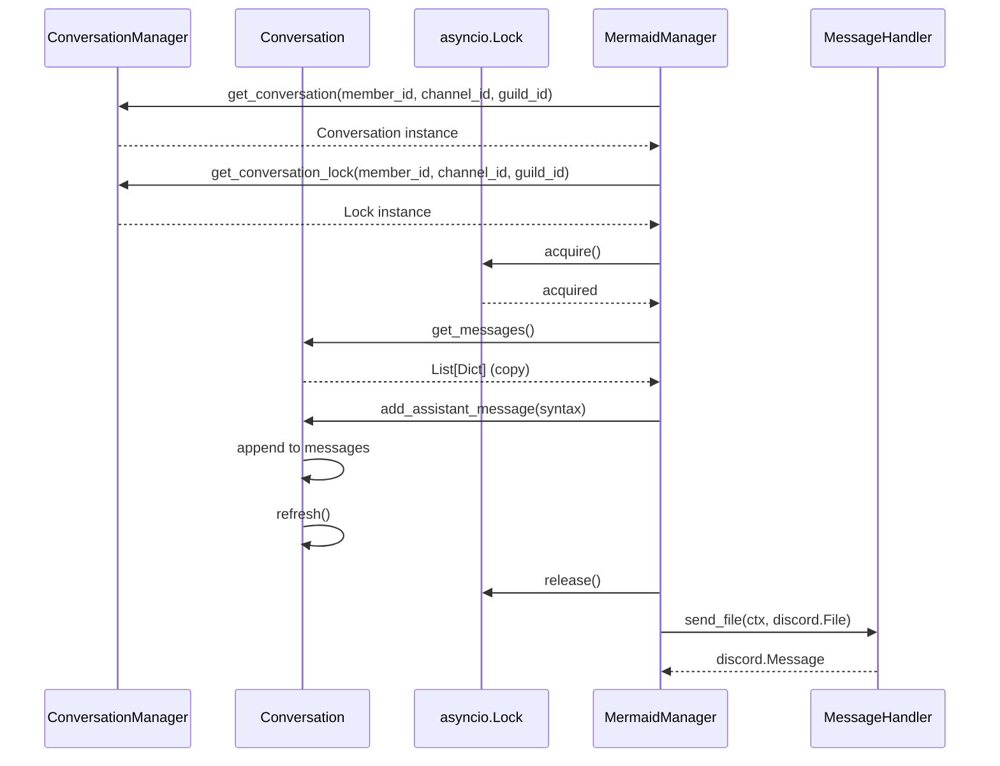
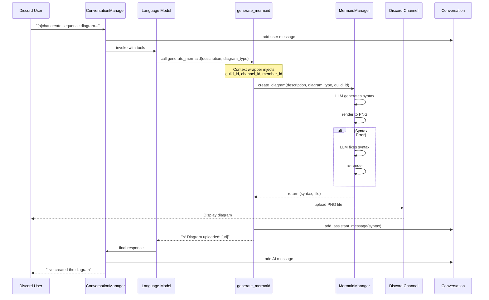

## Conversation Class Architecture

MessageHandler -> Discord End User facing messages.  
Sub Agents like the Mermaid Manager can also send messages to the Discord End User. In order for the Main Agent / Conversation Manager to keep track of the topic he has access to the Conservation Class.  
So far the Conversation Class has been exclusively between the Discord End User and the Conversation Manager.

