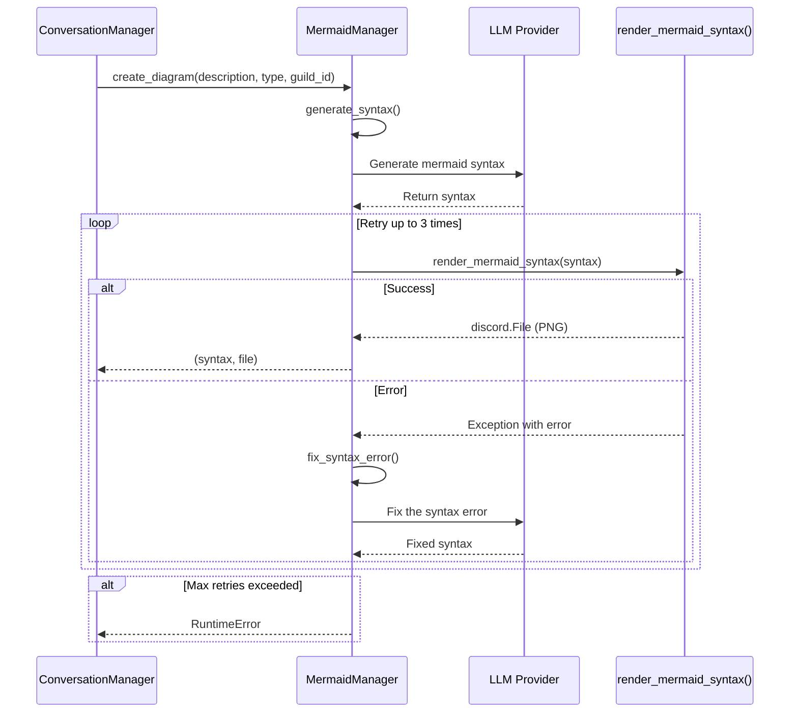

| Aspect                  | Decision                               | Rationale                                                                 |
|-------------------------|----------------------------------------|---------------------------------------------------------------------------|
| Context Independence    | MermaidManager has its own LLM calls   | Sub-agents don't share context with ConversationManager                   |
| No ChainHub Registration| Manager is NOT a tool                  | Delegation happens later, not via tool calling                        |
| Error Handling          | Retry loop with LLM-based fixing       | LLM can analyze and fix syntax errors intelligently                        |
| Return Type             | Tuple of (syntax, file)                | Syntax for conversation, file for Discord upload                          |
| Prompt Storage          | Class-level constants                  | Easy to modify and maintain prompts                                       |
| Max Retries             | 3 attempts                             | Balance between success rate and performance                               |
