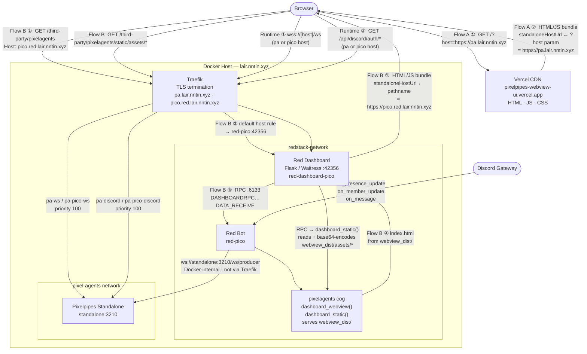

# Pixelagents Architecture

## Overview

`pixelagents` is a Red DiscordBot cog that does two things:

1. **Presence mirroring** — observes Discord guild events and drives agent
   lifecycle changes in the Pixelpipes standalone host over a producer WebSocket.
2. **Webview hosting** — serves the pre-built Pixelpipes browser bundle through
   the Red Web Dashboard third-party page system, making the webview accessible
   at `https://pico.red.lair.nntin.xyz/third-party/pixelagents`.

There are two public entry points for the browser:

- **Flow A** — `https://pixelpipes-webview-ui.vercel.app/?host=https://pa.lair.nntin.xyz`
  Static assets served by Vercel; the standalone host URL comes from the `?host=` query param.
- **Flow B** — `https://pico.red.lair.nntin.xyz/third-party/pixelagents`
  HTML and static assets served through the Red Dashboard and this cog; the standalone host
  URL is inferred from the page's own origin.

Both flows share the same runtime routes for WebSocket and Discord OAuth.
Node-RED is not in the presence mirroring path — it connects to the standalone separately as its own producer.



---

## Deployment: How the Webview Reaches the Browser

### Container layout

| Container | Image | Network | Role |
|---|---|---|---|
| `red-pico` | `phasecorex/red-discordbot` | `redstack-network`, `pixel-agents` | Discord bot + cog host |
| `red-dashboard-pico` | `redstack/red-web-dashboard:local` | shared via `network_mode: "service:red-pico"` | Flask/Waitress web server |
| `pixel-agents-standalone-1` | built from `pixel-agents` repo | `pixel-agents`, `lair-network` | Pixelpipes standalone host |
| `traefik` | Traefik | `redstack-network`, `lair-network` | TLS termination + routing |

`red-dashboard-pico` shares the network namespace of `red-pico` (no separate
IP). It talks to the Red bot over `localhost:6133` (RPC) and listens on
`:42356` for HTTP, which Traefik picks up from the `red-pico` container's IP.

### Traefik routing for `pico.red.lair.nntin.xyz`

Defined via Docker labels on the respective containers:

| Router | Rule | Destination |
|---|---|---|
| `red-pico` | `Host(pico.red.lair.nntin.xyz)` | `red-pico:42356` (Red Dashboard) |
| `pa-pico-ws` | `Host(pico.red.lair.nntin.xyz) && Path(/ws)` | `standalone:3210` — priority 100 |
| `pa-pico-discord` | `Host(pico.red.lair.nntin.xyz) && PathPrefix(/api/discord/)` | `standalone:3210` — priority 100 |

The two higher-priority rules intercept same-origin WebSocket connections and
Discord OAuth callbacks, forwarding them directly to the standalone host. All
other paths (including `/third-party/pixelagents`) fall through to the Red
Dashboard.

The `/ws/producer` path is intentionally absent from Traefik — the producer
connection from the cog stays internal on the `pixel-agents` Docker network
and is never exposed publicly.

### Red Dashboard serving the page

The Dashboard receives all paths not matched by the high-priority Traefik
rules. When a request arrives for `/third-party/pixelagents`, Flask routes it
through `third_parties_blueprint.third_party` (in `reddash/app/third_parties/routes.py`).
That calls `DASHBOARDRPC_THIRDPARTIES__DATA_RECEIVE` over the bot RPC
WebSocket, which invokes `dashboard_webview` on the cog. The cog returns
`index.html` from `webview_dist/`, rendered inline via `render_template_string`
with `standalone: true` so the Dashboard wraps it in no extra Chrome.

Static sub-assets (`/js`, `/css`, fonts, images) are served through a
companion route added by the `routes.py` patch:

```
GET /third-party/pixelagents/static/<asset_path>
  → Flask third_party_static()
  → DASHBOARDRPC_THIRDPARTIES__DATA_RECEIVE  (page="static", required_kwargs={"asset_path": …})
  → cog.dashboard_static()
  → reads webview_dist/<asset_path>, base64-encodes, returns raw_response dict
  → Flask decodes and streams with correct Content-Type + Cache-Control
```

The round-trip through the bot RPC happens on every static request; `Cache-Control: public, max-age=3600` in the response lets the browser cache assets for one hour.

---

## How `webview_dist` Is Generated

The browser bundle is built from the Pixelpipes (`pixel-agents`) repository
and then committed into this cog directory.

### Build command

```sh
# Run from the pixel-agents repo root
VITE_PIXEL_AGENTS_SAME_ORIGIN=true \
WEBVIEW_BASE=/third-party/pixelagents/static/ \
WEBVIEW_OUT_DIR=../dist/pico-webview \
npm exec -w webview-ui -- vite build
```

This is aliased as:

```sh
npm run build:webview:pico   # in pixel-agents/package.json
```

### What the flags do

| Variable | Effect |
|---|---|
| `VITE_PIXEL_AGENTS_SAME_ORIGIN=true` | Forces `runtime.ts` to use `window.location.origin` as the standalone host URL instead of requiring a `?host=` query param |
| `WEBVIEW_BASE=/third-party/pixelagents/static/` | Sets Vite's `base`, so all asset hrefs in the output HTML are absolute paths under `/third-party/pixelagents/static/` |
| `WEBVIEW_OUT_DIR=../dist/pico-webview` | Output directory relative to `webview-ui/` |

`VITE_PIXEL_AGENTS_SAME_ORIGIN=true` is belt-and-suspenders: `runtime.ts` also
detects `isDashboardHosted` at runtime by checking whether `pathname` starts
with `/third-party/pixelagents`, so it resolves the host correctly regardless
of the build flag:

```ts
const isDashboardHosted =
  path === '/third-party/pixelagents' || path.startsWith('/third-party/pixelagents/');
const isProduction = Boolean(env?.PROD || env?.VITE_PIXEL_AGENTS_SAME_ORIGIN === 'true');
if (isProduction || isDashboardHosted) {
  return browserGlobals.location.origin;  // → "https://pico.red.lair.nntin.xyz"
}
```

This resolved origin becomes the WebSocket URL (`wss://pico.red.lair.nntin.xyz/ws`)
and the Discord OAuth base URL (`https://pico.red.lair.nntin.xyz/api/discord/…`).

### Vendoring the build output

After building:

```sh
cp -r pixel-agents/dist/pico-webview/* \
      redstack/cogs/d-cogs/pixelagents/webview_dist/
```

`webview_dist/` is committed into the cog directory and read at runtime by
`dashboard_webview` / `dashboard_static`. The cog has no build-time dependency
on the Pixelpipes repo at deploy time.

### Updating the bundle

1. Make changes in the `pixel-agents` webview.
2. Run `npm run build:webview:pico` from the `pixel-agents` root.
3. Copy output to `webview_dist/` and commit.
4. Rebuild the `redstack/red-web-dashboard:local` Docker image and recreate
   `red-dashboard-pico` (the cog directory is volume-mounted at
   `/cogs` inside `red-pico`, so the Red bot picks up file changes without
   a rebuild; however the Dashboard image embeds the patched `routes.py` and
   must be rebuilt when that file changes).

---

## Configuration Model

Global:

| Key | Default | Description |
|---|---|---|
| `producer_url` | `ws://standalone:3210/ws/producer` | Pixelpipes producer WebSocket URL |
| `message_tool_clear_delay` | `2.0` | Seconds to keep the Discord message bubble visible |
| `editor_role_id` | `None` | Discord role ID granting webview editor access |
| `broadcast_rich_presence` | `True` | Whether to send Spotify/game activity as tool bubbles |
| `broadcast_messages` | `True` | Whether to send Discord messages as tool bubbles |

Guild:

| Key | Default | Description |
|---|---|---|
| `enabled` | `False` | Mirror this guild's presence |
| `include_bots` | `True` | Include bot users |

User:

| Key | Description |
|---|---|
| `layouts` | Dict of saved layout records keyed by normalised layout name |

---

## Agent Identity

```python
_JS_MAX_SAFE = (1 << 53) - 1  # 9007199254740991

def _discord_id_to_agent_id(user_id: int) -> int:
    mapped = user_id % _JS_MAX_SAFE
    return -(mapped if mapped != 0 else _JS_MAX_SAFE)
```

- Always **negative** — does not collide with Node-RED's positive overlay IDs.
- **Stable** across cog restarts (derived from Discord user ID only).
- **JavaScript-safe**: magnitude ≤ 2^53 − 1.
- Collisions are logged at WARNING level (extremely unlikely in practice).

---

## Producer Protocol

The cog connects to `ws://standalone:3210/ws/producer` (internal Docker
network, never exposed through Traefik).

On connect:

```json
{ "type": "producerHello", "capabilities": ["auth-check", "layout-control"] }
```

The standalone routes `producerAuthCheckRequest` only to producers that
advertise `auth-check`, and layout snapshot/load requests only to those that
advertise `layout-control`.

### Bootstrap

When the standalone sends `producerBootstrapRequest` (after connect or
restart), the cog replies with `existingAgents` + one `agentTeamInfo` per
tracked agent to repopulate the host's overlay.

### Presence lifecycle

| Discord status | Cog action |
|---|---|
| `online` / `idle` / `dnd` | `agentCreated` → `agentTeamInfo` → `agentStatus` |
| `offline` / `invisible` | `agentClosed` |
| status change (e.g. `online` → `dnd`) | `agentClosed` + new `agentCreated` (folderName is immutable) |
| display name change | `agentTeamInfo` with new name |
| non-custom rich presence | `agentStatus: "active"` + `agentToolStart` for Activity label |
| no rich presence | `agentStatus: "waiting"` |

After every state change the cog sends `existingAgents` so the standalone can
reconcile its overlay.

### Discord message activity

```json
{ "type": "agentToolStart", "id": <agentId>,
  "toolId": "msg-<messageId>", "toolName": "Message", "status": "<40 chars>" }
```

After `message_tool_clear_delay` seconds:

```json
{ "type": "agentToolsClear", "id": <agentId> }
```

If the agent had a rich-presence label before the message, `_send_presence_tool`
is re-sent after the clear so the Activity bubble reappears.

### Layout control

Save → snapshot request / load → load request, both over the producer
WebSocket with a UUID `requestId` and a 10-second `asyncio.wait_for` timeout.
The host replies with `producerLayoutSnapshotReply` / `producerLayoutLoadReply`.

---

## Editor Authorization

The standalone sends `producerAuthCheckRequest` when a browser completes
Discord OAuth login at `/api/discord/auth/start`. The cog replies with
`producerAuthCheckReply`:

```
Allow if ANY of:
  1. Discord user is a bot owner
  2. User is an administrator in any enabled guild
  3. editor_role_id is set and user has that role in any enabled guild
Deny otherwise (including unknown user_id or Discord lookup failure)
```

The OAuth callback URL must match what is registered in the Discord Developer
Portal. For the Pico deployment: `https://pico.red.lair.nntin.xyz/api/discord/auth/callback`
(set via `DISCORD_REDIRECT_URI` in `pixelpipes/.env`).

---

## Connection and Reconnect

- On `cog_load`: starts `_connect_loop` as an asyncio Task.
- On connect: sends `producerHello`, runs full guild sync.
- On disconnect or error: exponential backoff, 1s → 2s → 4s → … max 60s.
- On reconnect: re-sends `producerHello`, re-runs full sync.
- Deterministic agent IDs prevent duplicate agents after reconnect.

---

## Security and Privacy

- Discord user IDs, guild IDs, display names, presence labels, and message
  content (truncated to 40 chars) are sent to the producer endpoint.
- The producer endpoint (`standalone:3210/ws/producer`) is on the `pixel-agents`
  Docker network only — never exposed through Traefik.
- The Dashboard static asset route (RPC over `localhost:6133`) requires no
  external credentials; the Docker network is the trust boundary.
- `_resolve_webview_asset` enforces a path-traversal guard: `candidate.relative_to(root)` rejects any path that escapes `webview_dist/`.

---

## Commands

| Command | Description |
|---|---|
| `[p]pixelagents status` | Show configuration and connection status |
| `[p]pixelagents enable` | Enable guild mirroring and run a full sync |
| `[p]pixelagents disable` | Disable guild mirroring and despawn all agents |
| `[p]pixelagents sync` | Manually reconcile guild members |
| `[p]pixelagents despawnall` | Despawn all tracked agents without disabling |
| `[p]pixelagents includebots <true/false>` | Toggle bot user mirroring |
| `[p]pixelagents producerurl <url>` | Override the producer WebSocket URL |
| `[p]pixelagents toolcleardelay <seconds>` | Set message indicator duration |
| `[p]pixelagents richpresence <true/false>` | Toggle Spotify/game activity bubbles |
| `[p]pixelagents messages <true/false>` | Toggle Discord message tool bubbles |
| `[p]pixelagents editorrole [role]` | Set or clear the editor role |
| `[p]pixelagents layout save <name> [overwrite]` | Save the host's current layout |
| `[p]pixelagents layout load <name>` | Force-load a saved layout into the shared frontend |
| `[p]pixelagents layout delete <name>` | Delete a saved layout |
| `[p]pixelagents layout list` | List saved layouts |
| `[p]pixelagents layout share <name>` | Upload a saved layout as a JSON attachment |

---

## End-to-End Verification

1. Confirm `pixel-agents` Docker network exists; `red-pico` and `standalone`
   are both attached to it.
2. Load the cog. `[p]pixelagents status` should show "Connected: ✅".
3. Enable a guild: `[p]pixelagents enable`.
4. Open `https://pico.red.lair.nntin.xyz/third-party/pixelagents` in a browser.
5. Confirm online/idle/dnd users appear as agents; going offline despawns them.
6. Send a Discord message from a tracked user — confirm the tool bubble appears
   and clears after `message_tool_clear_delay` seconds.
7. For editor auth: complete Discord OAuth at `/api/discord/auth/start`.
   Bot owners, guild administrators, and configured-role members should be
   granted editor access; others denied.
8. Save, list, load, delete, and share a layout via the Discord layout commands.

## Rebuilding After Changes

| What changed | Action required |
|---|---|
| `pixelagents.py` or `webview_dist/` | None — cog directory is volume-mounted; Red hot-reloads or `[p]reload pixelagents` |
| `vendor/red-web-dashboard/reddash/…` (routes patch) | `docker compose build red-dashboard-pico && docker compose up -d red-dashboard-pico` (from `projects/redstack/`) |
| `webview-ui/` source in pixel-agents repo | `npm run build:webview:pico` → copy output to `webview_dist/` → reload cog |
| `pixelpipes/docker-compose.yml` Traefik labels | `docker compose up -d standalone` (from `projects/pixelpipes/`) |
| `pixelpipes/.env` (e.g. `DISCORD_REDIRECT_URI`) | `docker compose up -d standalone` (from `projects/pixelpipes/`) |
