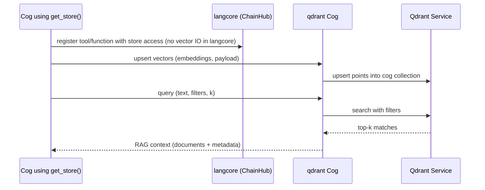
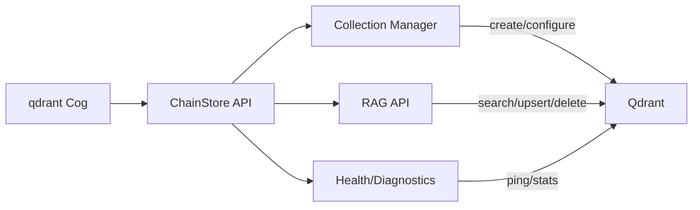

# Qdrant Cog Roadmap

Roadmap for the `qdrant` cog: the `ChainStore` implementation used by `langcore` to provide shared vector storage and the RAG pipeline. `langcore` itself does **not** store or retrieve vectors; only extension cogs do, and each cog that calls `langcore.get_store()` writes to its own Qdrant collection to avoid collisions.

## Vision and Principles
- Single, pluggable ChainStore for all cogs; each cog owns its collection (no shared indexes by default).
- RAG pipeline lives in this cog (migrated from `ragutils`); extension cogs call into it via `langcore` interfaces, but `langcore` itself never touches the vector DB.
- Configuration-first: collections, dimensions, and distance metrics configurable per cog; sensible defaults.
- Safe multi-tenant operation inside one Qdrant instance with namespacing, TTLs/cleanup hooks, and usage limits.

## High-Level Architecture
```mermaid
graph TD
	subgraph DiscordBot
		LangCore[langcore: ChainHub (no vector IO)]
		QdrantCog[qdrant: ChainStore]
		OtherCogs[Extension cogs using get_store]
	end

	subgraph QdrantCluster[Qdrant Server]
		CollA[Collection: spoilarr]
		CollB[Collection: memory]
		CollC[Collection: embed]
	end

	LangCore -.->|tool schemas / store handle| QdrantCog
	OtherCogs -->|write/read own collection| QdrantCog
	QdrantCog -->|CRUD + search| QdrantCluster
```

## Data Model and Collections
- **Per-cog collections**: collection name convention `${cog_name}` (optionally `${cog_name}_${guild}` if isolation per guild is enabled later).
- **Payload schema** (minimal baseline): `text`, `source` (cog + context), `metadata` dict, `embedding_model`, `timestamp`.
- **Vector parameters**: dimension and distance metric configurable per collection; defaults follow provider embedding size and cosine distance.
- **Partitioning options** (later): optional shards/replicas if Qdrant cluster is used.

## RAG Pipeline (migrated from `ragutils`)


### Pipeline Components
- **Embedder abstraction**: select embedding model from provider; supply dimension to collection config.
- **Upsert**: dedupe by `id`/`hash`, batch writes, optional TTL or logical delete flag for cleanup.
- **Query**: vector search + optional metadata filters; return scored documents to the calling cog (for its conversation/agent flow).
- **Retrieval composition**: support `similarity` and `mmr` (later) reranking on top of Qdrant results.

## Feature Set (phased)
1) **MVP (aligns with current `ragutils`)**
   - Upsert/search/delete APIs exposed via ChainStore interface.
   - Per-cog collections, auto-create with correct dimension/metric.
	- Basic RAG helpers: chunking hook (delegated to caller), vector search, return payloads to the calling cog.
2) **Quality & Ops**
   - Health checks and readiness probe (Qdrant connectivity, collections exist).
   - Structured logging for latency and errors; backoff/retry on transient failures.
   - Admin commands to inspect collections, counts, and purge.
3) **Advanced RAG**
   - Metadata filters and payload-based filters (guild/channel/user scoping when needed).
   - Rerank options (MMR/local reranker) applied after Qdrant search.
   - Optional per-guild isolation via collection suffixes.
4) **Lifecycle & Hygiene**
   - TTL/soft-delete cleanup tasks.
   - Migration helpers (recreate collection with new dimensions/metrics, reindex from source).
5) **Testing & Tooling**
   - Integration tests against ephemeral Qdrant.
   - Load/latency benchmarks for typical k and payload sizes.

## Component Responsibilities


## Configuration
- Qdrant endpoint, API key (if used), and TLS settings.
- Default embedding model + dimension; overrides per collection.
- Distance metric default (cosine) with per-collection override.
- Limits: max `k`, max batch size, max payload size.

## Commands / Admin (planned)
- `qdrant stats` – connection check and version info.
- `qdrant collections` – list collections, dimensions, counts.
- `qdrant purge <collection>` – delete a cog’s collection (guarded).
- `qdrant reindex <collection>` – recreate with new config (future).

## Migration from `ragutils`
- Move RAG pipeline code into this cog; `ragutils` becomes a thin shim or is retired.
- Update langcore to reference the new ChainStore implementation; all cogs using `langcore.get_store()` write to their own collections.
- Keep API-compatible helpers to avoid breaking existing tool schemas where possible.

## Risks and Mitigations
- **Dimension mismatch**: validate on upsert; auto-recreate collection when safe.
- **Unbounded growth**: offer TTL/cleanup and quotas.
- **Latency under load**: batch writes, limit `k`, expose metrics to tune.

## Success Criteria
- Cogs can read/write their own collections without collisions.
- RAG queries return deterministic, filtered results for the calling cog/agent flows.
- Admin visibility into collection health and ability to purge/rebuild safely.

